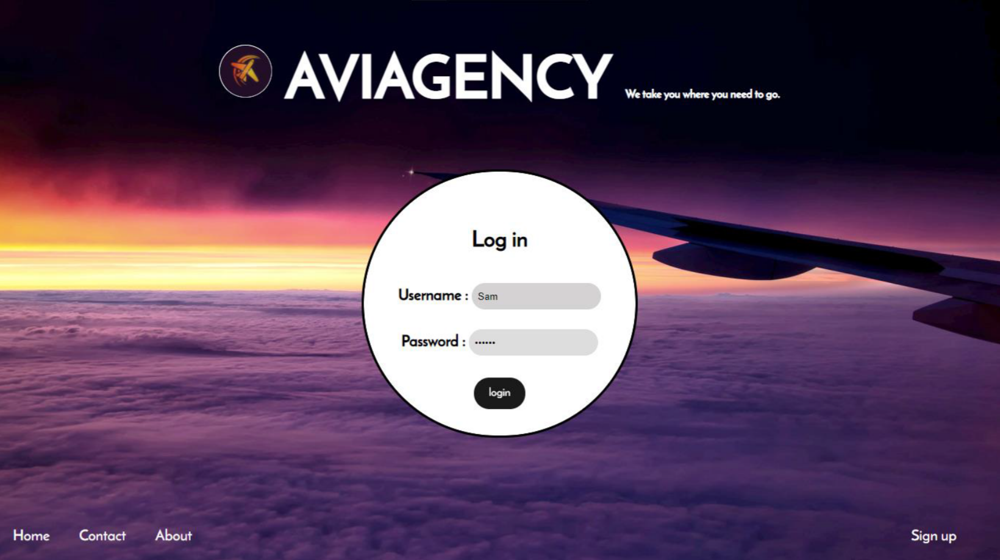
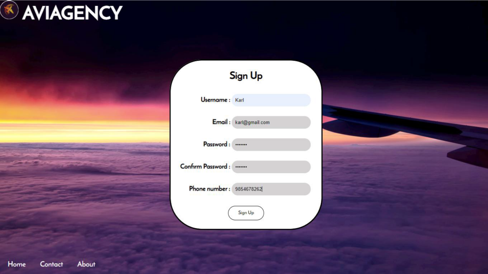
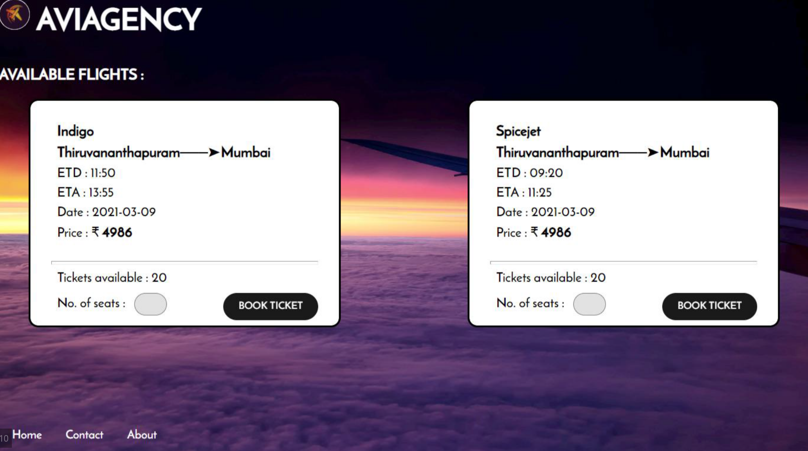
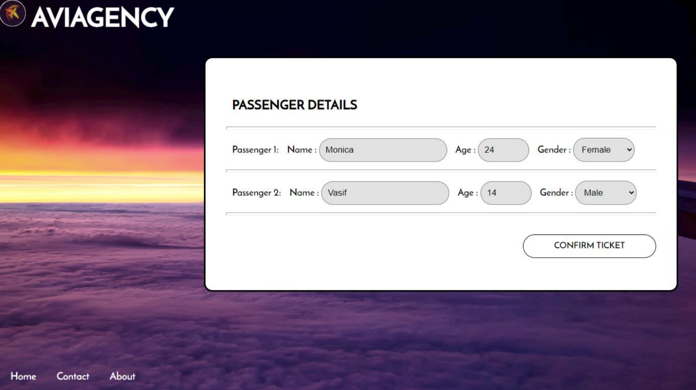

# Aviagency

Aviagency is an online airline booking system that provides users with a seamless interface to book air tickets from the comfort of their home. The application allows users to search for flights, check seat availability, book tickets, and manage their bookings with ease. The frontend is built using HTML and CSS, while the backend is developed with Python and Flask, and MySQL is used for the database.

## Features

- **User Authentication**: Allows users to sign up and log in to manage their bookings.
- **Flight Search**: Users can search for available flights and check seat availability.
- **Booking Management**: Users can book, view, and cancel tickets.
- **Price Calculation**: Automated calculation of ticket prices based on selected flights.
- **Database Integration**: Stores and manages booking data using MySQL.
- **User-Friendly Interface**: Simple and intuitive interface designed for ease of use.

## System Design

### System Requirements

#### Hardware:
- **Processor**: Intel Pentium i3 or higher
- **RAM**: 2GB or higher

#### Software:
- **Interpreter**: Python 3.6 or the latest version
- **RDBMS**: MySQL 5.5 or the latest version
- **Modules**: `mysql.connector`, `Flask`, `Jinja2`
- **User Interface**: HTML, CSS

### Installation

1. **Clone the repository:**
    ```bash
    git clone https://github.com/awxsoul/Aviagency.git
    cd Aviagency
    ```

2. **Set up a virtual environment and activate it:**
    ```bash
    python -m venv venv
    source venv/bin/activate  # On Windows, use `venv\Scripts\activate`
    ```

3. **Install the required packages:**
    ```bash
    pip install -r requirements.txt
    ```

4. **Set up the MySQL database:**
    - Create a database named `aviagency`.
    - Execute the SQL commands in `sql_command.txt` to create the necessary tables.
    - Update the database configuration in the application as needed.

### Usage

1. **Run the Flask application:**
    ```bash
    python __main__.py
    ```

2. **Open your browser and navigate to `http://127.0.0.1:5000`.**

3. **Use the interface to search for flights, book tickets, and manage your bookings.**

### File Structure

- `__main__.py`: The main Flask application.
- `static/`: Static files for the Flask application (CSS, JS, images).
- `templates/`: HTML templates for the Flask application.
- `login_details.csv`: Stores user login details.
- `sql_command.txt`: SQL commands for setting up the database.
- `AVIAGENCY.pdf`: Documentation for the project.
- `README.md`: Basic information about the project.
- `debug.log`: Log file for debugging.

### Screenshots

#### Login Page


#### Sign Up Page


#### Home Page


#### Book Ticket Page


#### Booking Confirmation


More screenshots in [Aviagency Document](AVIAGENCY.pdf)
